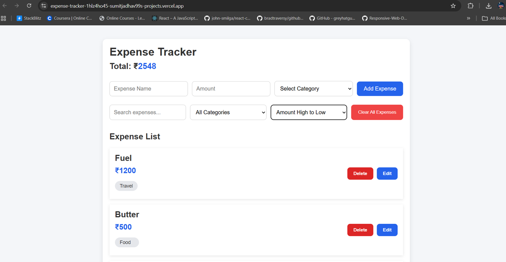
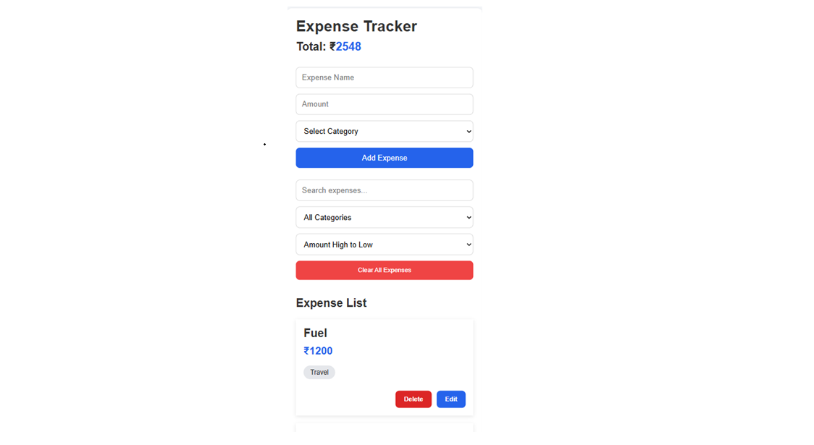

# 💰 Expense Tracker


A modern and responsive expense management application built with **React**. Users can add, edit, delete, search, filter, and sort expenses while keeping their data persistent using **Local Storage**.

## 🚀 Live Demo

👉 **[View Live Application](https://expense-tracker-1hlz4ho45-sumitjadhav99s-projects.vercel.app/)**

## 📑 Table of Contents

- [💰 Expense Tracker](#-expense-tracker)
  - [🚀 Live Demo](#-live-demo)
  - [📑 Table of Contents](#-table-of-contents)
  - [📸 Screenshots](#-screenshots)
    - [Desktop View](#desktop-view)
    - [Mobile View](#mobile-view)
  - [✨ Features](#-features)
    - [Expense Management](#expense-management)
    - [Search \& Filtering](#search--filtering)
    - [User Experience](#user-experience)
  - [🛠️ Tech Stack](#️-tech-stack)
  - [📂 Project Structure](#-project-structure)
  - [⚡ Installation](#-installation)
  - [📖 What I Learned](#-what-i-learned)
  - [🚀 Future Improvements](#-future-improvements)
  - [👨‍💻 Author](#-author)

## 📸 Screenshots

### Desktop View



### Mobile View



## ✨ Features

### Expense Management
- ➕ Add expenses
- ✏️ Edit expenses
- 🗑️ Delete expenses

### Search & Filtering
- 🔍 Search by title
- 🏷️ Filter by category
- 📊 Sort by amount

### User Experience
- 💰 Total expense calculation
- 💾 Local Storage persistence
- 📱 Responsive design
- 🧹 Clear all confirmation

## 🛠️ Tech Stack

| Technology | Purpose |
|------------|---------|
| React | Frontend library |
| JavaScript (ES6+) | Application logic |
| CSS3 | Styling |
| HTML5 | Markup |
| Vite | Build tool |
| Git & GitHub | Version control |
| Vercel | Deployment |

## 📂 Project Structure

```
expense-tracker
├── assets
│   ├── desktop.png
│   └── mobile.png
├── public
├── src
│   ├── components
│   │   ├── ExpenseForm.jsx
│   │   ├── ExpenseItem.jsx
│   │   ├── ExpenseList.jsx
│   │   └── Summary.jsx
│   ├── App.jsx
│   ├── App.css
│   ├── index.css
│   └── main.jsx
├── README.md
└── package.json
```

## ⚡ Installation

```bash
git clone https://github.com/sumitjadhav99/expense-tracker.git
cd expense-tracker
npm install
npm run dev
```

## 📖 What I Learned

While building this project, I strengthened my understanding of:

- React Hooks (`useState` and `useEffect`)
- Component-based architecture
- Props and state management
- CRUD operations in React
- Local Storage for data persistence
- Search, filtering, and sorting logic
- Responsive layouts using Flexbox and Media Queries
- Git workflow and deployment using Vercel

## 🚀 Future Improvements

- Expense charts and analytics
- Monthly expense reports
- Dark mode
- User authentication
- Backend integration with a database

## 👨‍💻 Author

**Sumit Jadhav**

- GitHub: https://github.com/sumitjadhav99
- LinkedIn: https://www.linkedin.com/in/sumithjadhav

---

⭐ If you found this project helpful, feel free to star the repository.